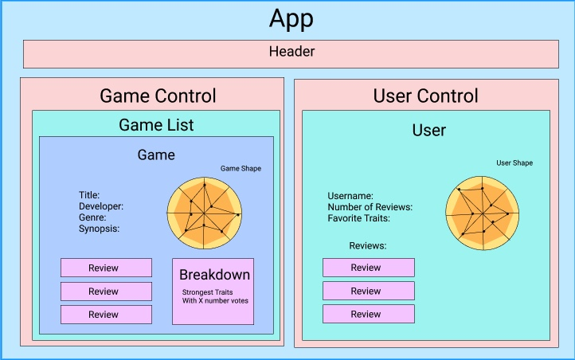

**<h1 align = "center"> Game Gems**


**<h2 align="center">Every game is good at something**


**<h4 align = "center">
  <a href="#requirements">Requirements</a> •
  <a href="#diagram">Diagram</a> •
  <a href="#setup">Setup</a> •
  <a href="#protecting-your-data">Protecting Data<a> •
  <a href="#questions-and-concerns">Q's & C's</a> •
  <a href="#technologies-used">Technologies</a> •
  <a href="#bugs">Bugs</a> •  
  <a href="#contributors">Contributors</a> •
  <a href="#license">License</a>**

<br>
<h2 align = "center">
</h1>

**ABOUT**

Game Gems is an application that aims to find a more positive way to evaluate video games. The application allows the user to choose 3 qualities about a game that they really enjoyed. This data is aggregated and displayed in a radar chart called a 'gem', outlining the game's most popular strengths. This model is designed to ask players to consider what it was that made a game so special to them, or to draw out the better qualities of one they didn't enjoy as much. Every game does something well. Over time, the intention is that players will become more aware of the traits that they enjoy in games and to try others that feature similar ratings.


## **REQUIREMENTS**

* Install [Git v2.62.2+](https://git-scm.com/downloads/)
* Install [Javascript](https://www.javascript.com/)
* Install [Visual Studio Code](https://code.visualstudio.com/)
* Install [React](https://reactjs.org/)

 <br>

## **DIAGRAM**




## **USER STORIES**

- As a user, I should be able to authenticate my identity and log in.
- As a user, I should be able to access a game's details page and submit a review form for that game.
- As a user, I should be able to see the aggregated data for that game (by percentage) in a radar graph format.

## **SETUP**


copy this url to clone this project to your local system:
```html
https://github.com/jhenager/game-gems.git
```

<br>

Once copied, select "Clone Repository" from within VSCode & paste the copied link as shown in the image below.


<br>

* _Run the application_
  1. _In the terminal, navigate to the project directory by running the command `> cd game-shapes`_
  2. _Now that we are in the the-tap directory you will run the command `> npm install` followed by `> npm start`_
  3. _Go to http://localhost:3000/ in your preferred browser to use the application_


## **PROTECTING YOUR DATA**

#### **Step 1: From within VSCode in the root project directory, we will create a .gitignore file**

# For Mac Users
```js 
touch .gitignore 
```

# For Windows Users:

```js 
ni .gitignore 
```

#### Step 2: commit that .gitignore file (this prevents your sensitive information from being shown to others). **⚠️DO NOT PROCEED UNTIL YOU DO!⚠️**


#### Step 3: **To commit your .gitignore file enter the following commands**

```js
git add .gitignore
```
```js
git commit -m "protect data"
```


<br>

## Available Scripts

In the project directory, you can run:

### `npm start`

Runs the app in the development mode.<br />
Open [http://localhost:3000](http://localhost:3000) to view it in the browser.

The page will reload if you make edits.<br />
You will also see any lint errors in the console.

### `npm test`

Launches the test runner in the interactive watch mode.<br />
See the section about [running tests](https://facebook.github.io/create-react-app/docs/running-tests) for more information.

### `npm run build`

Builds the app for production to the `build` folder.<br />
It correctly bundles React in production mode and optimizes the build for the best performance.

The build is minified and the filenames include the hashes.<br />
Your app is ready to be deployed!

See the section about [deployment](https://facebook.github.io/create-react-app/docs/deployment) for more information.

### `npm run eject`

**Note: this is a one-way operation. Once you `eject`, you can’t go back!**

If you aren’t satisfied with the build tool and configuration choices, you can `eject` at any time. This command will remove the single build dependency from your project.

Instead, it will copy all the configuration files and the transitive dependencies (webpack, Babel, ESLint, etc) right into your project so you have full control over them. All of the commands except `eject` will still work, but they will point to the copied scripts so you can tweak them. At this point you’re on your own.

You don’t have to ever use `eject`. The curated feature set is suitable for small and middle deployments, and you shouldn’t feel obligated to use this feature. However we understand that this tool wouldn’t be useful if you couldn’t customize it when you are ready for it.

## Learn More

You can learn more in the [Create React App documentation](https://facebook.github.io/create-react-app/docs/getting-started).

To learn React, check out the [React documentation](https://reactjs.org/).

### Code Splitting

This section has moved here: https://facebook.github.io/create-react-app/docs/code-splitting

### Analyzing the Bundle Size

This section has moved here: https://facebook.github.io/create-react-app/docs/analyzing-the-bundle-size

### Making a Progressive Web App

This section has moved here: https://facebook.github.io/create-react-app/docs/making-a-progressive-web-app

### Advanced Configuration

This section has moved here: https://facebook.github.io/create-react-app/docs/advanced-configuration

### Deployment

This section has moved here: https://facebook.github.io/create-react-app/docs/deployment

### `npm run build` fails to minify

This section has moved here: https://facebook.github.io/create-react-app/docs/troubleshooting#npm-run-build-fails-to-minify
